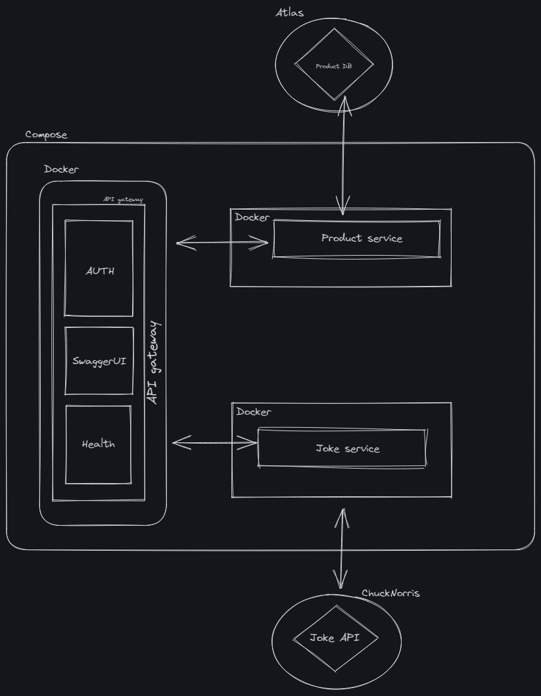

# UOL Microserviços

Teste realizado com o intuito de desenvolver uma arquitetura de microserviços de posts e "piadas".

O sistema desenvolvido constiste em três partes, sendo dois microserviços e um API Gateway.

## How to run? || Como rodar?

Basta estar no diretório do projeto e rodar o docker compose.

    docker compose up

A solução será hosteada localmente na porta 80. Basta abrir o navegador e navegar até `http://localhost/swagger`.

## Solução

A solução foi completamente desenvolvida, e os pontos opcionais, apenas autenticação, um API gateway e um pequeno desenho arquitetural.

### arquitetura

### Posts

Microserviço destinado a todas ações dos pots, criação, listagem, atualização e deleção.

### Joke

Microserviço que faz a integração com uma API externa para a geração de piadas aleatórias.

### Gateway

O gateway é responsável por fazer a autenticação dos microserviços através de JWTs. Além disso, também faz a verificação do status dos outros microserviços.

O gateway funciona como um proxy, basicamente redirecionando as requisições para os serviços de destino.

Além disso, também é reponsável por servir o swagger.

### Notes

Sabemos que não se deve enviar variáveis de ambiente para o repositório, mas a fim de facilitar a execução da aplicação no âmbito de uma POC, mantive as variáveis.
